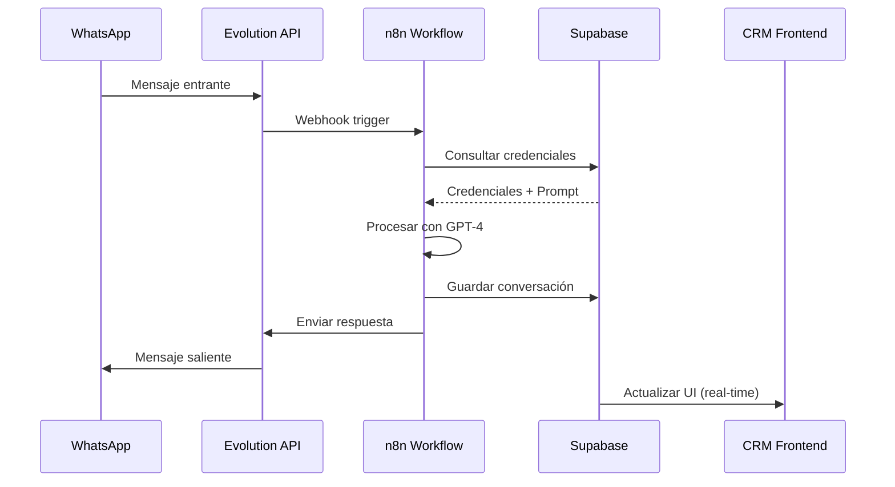

# Documentación Técnica - Panel de Control CRM con Agentes de IA

## 📋 Índice

1. [Resumen Ejecutivo](#resumen-ejecutivo)
2. [Arquitectura del Sistema](#arquitectura-del-sistema)
3. [Stack Tecnológico](#stack-tecnológico)
4. [Funcionalidades Principales](#funcionalidades-principales)
5. [Configuración y Despliegue](#configuración-y-despliegue)
6. [Seguridad y Accesos](#seguridad-y-accesos)
7. [Integraciones Externas](#integraciones-externas)
8. [Base de Datos](#base-de-datos)
9. [API y Webhooks](#api-y-webhooks)
10. [Mantenimiento y Monitoreo](#mantenimiento-y-monitoreo)

---

## 📊 Resumen Ejecutivo

### Propósito del Proyecto
Este sistema es un **Panel de Control CRM** diseñado para gestionar agentes de inteligencia artificial que automatizan interacciones con clientes a través de múltiples canales, principalmente WhatsApp. El sistema permite orquestar workflows de n8n, gestionar credenciales, administrar pipelines de ventas y monitorear conversaciones en tiempo real.

### Caso de Uso Principal
Empresas que necesitan automatizar su atención al cliente, calificación de leads y seguimiento de ventas mediante agentes de IA que se integran con:
- WhatsApp Business (vía Evolution API)
- Workflows de automatización n8n
- OpenAI GPT-4 para procesamiento de lenguaje natural
- Bases de datos y CRMs externos

### Alcances del Sistema

#### ✅ Funcionalidades Implementadas
- **Gestión de Agentes de IA**: Creación, configuración y monitoreo de agentes
- **Panel de Control**: Visualización de métricas y actividad en tiempo real
- **Integración WhatsApp**: Chat bidireccional con soporte Evolution API
- **Sistema de Webhooks**: Configuración y testing de webhooks n8n
- **Pipeline de Ventas**: Gestión visual tipo Kanban de conversaciones
- **Gestión de Credenciales**: Almacenamiento seguro de API keys y prompts
- **Sistema de Roles**: Control de acceso basado en roles (Admin, Moderador, Usuario)

#### ⚠️ Limitaciones Actuales
- Autenticación en modo demo (no implementada completamente)
- Conexión a Supabase pendiente de configuración activa
- Sistema de roles creado pero pendiente de integración completa
- Métricas y estadísticas en modo mock (datos de ejemplo)

#### 🎯 Alcance Futuro Recomendado
- Implementar autenticación real con Supabase Auth
- Conectar completamente con base de datos Supabase
- Integrar analytics y métricas en tiempo real
- Añadir notificaciones push y alertas
- Implementar historial de conversaciones
- Agregar exportación de reportes

---

## 🏗️ Arquitectura del Sistema

### Diagrama de Arquitectura

```
┌─────────────────────────────────────────────────────────────┐
│                     FRONTEND (React + Vite)                  │
│                                                              │
│  ┌──────────┐  ┌──────────┐  ┌──────────┐  ┌──────────┐   │
│  │Dashboard │  │  Agents  │  │ Pipeline │  │ WhatsApp │   │
│  └──────────┘  └──────────┘  └──────────┘  └──────────┘   │
│  ┌──────────┐  ┌──────────┐                                │
│  │Webhooks  │  │Credentials│                                │
│  └──────────┘  └──────────┘                                │
└─────────────────────────────────────────────────────────────┘
                            │
                            │ HTTP/REST
                            ▼
┌─────────────────────────────────────────────────────────────┐
│                    SUPABASE BACKEND                          │
│                                                              │
│  ┌──────────────┐  ┌──────────────┐  ┌──────────────┐     │
│  │  PostgreSQL  │  │ Auth Service │  │ Edge Functions│     │
│  │   Database   │  │              │  │   (n8n-api)   │     │
│  └──────────────┘  └──────────────┘  └──────────────┘     │
└─────────────────────────────────────────────────────────────┘
                            │
                            │
         ┌──────────────────┼──────────────────┐
         │                  │                  │
         ▼                  ▼                  ▼
┌─────────────┐    ┌─────────────┐    ┌─────────────┐
│   n8n API   │    │Evolution API│    │  OpenAI API │
│  Workflows  │    │  WhatsApp   │    │   GPT-4     │
└─────────────┘    └─────────────┘    └─────────────┘
```

### Flujo de Datos Principal

1. **Usuario → Frontend**: Interacción a través de la interfaz web
2. **Frontend → Supabase**: Consultas a base de datos y autenticación
3. **Supabase Edge Function → n8n**: Ejecución de workflows
4. **n8n → Evolution API**: Envío/recepción de mensajes WhatsApp
5. **n8n → OpenAI**: Procesamiento de lenguaje natural
6. **Respuesta → Usuario**: Visualización de resultados en tiempo real

---

## 💻 Stack Tecnológico

### Frontend
| Tecnología | Versión | Propósito |
|------------|---------|-----------|
| **React** | ^18.3.1 | Framework principal de UI |
| **TypeScript** | ^5.5.3 | Type safety y desarrollo |
| **Vite** | ^5.4.2 | Build tool y dev server |
| **Tailwind CSS** | ^3.4.1 | Framework de estilos |
| **shadcn/ui** | latest | Componentes UI pre-construidos |

### Librerías Principales
```json
{
  "@supabase/supabase-js": "^2.50.4",     // Cliente Supabase
  "@tanstack/react-query": "^5.56.2",     // Gestión de estado async
  "react-router-dom": "^6.26.2",          // Routing
  "lucide-react": "^0.462.0",             // Iconos
  "@dnd-kit/core": "^6.3.1",              // Drag & drop (Pipeline)
  "react-hook-form": "^7.53.0",           // Formularios
  "zod": "^3.23.8",                       // Validación
  "sonner": "^1.5.0"                      // Notificaciones
}
```

### Backend & Servicios

| Servicio | Tecnología | Propósito |
|----------|-----------|-----------|
| **Base de Datos** | Supabase PostgreSQL | Almacenamiento persistente |
| **Autenticación** | Supabase Auth | Gestión de usuarios y sesiones |
| **Edge Functions** | Deno/TypeScript | Lógica serverless |
| **Workflows** | n8n | Automatización de procesos |
| **WhatsApp** | Evolution API | Integración de mensajería |
| **IA** | OpenAI GPT-4 | Procesamiento de lenguaje natural |

### Infraestructura
- **Hosting Frontend**: Lovable (https://lovable.dev)
- **Backend**: Supabase Cloud
- **n8n**: Self-hosted o n8n Cloud
- **Evolution API**: Self-hosted

---

## 🎯 Funcionalidades Principales

### 1. Dashboard (Página Principal)

**Ruta**: `/`

**Componentes**:
- `src/pages/Dashboard.tsx`

**Características**:
- Vista general del sistema
- Tarjetas de estadísticas (agentes activos, mensajes/hora, webhooks)
- Actividad reciente en tiempo real
- Acciones rápidas (nueva conversación, configurar agente, etc.)

**Métricas Mostradas**:
```typescript
{
  activeAgents: number,      // Agentes actualmente activos
  totalAgents: number,       // Total de agentes configurados
  messagesPerHour: number,   // Tasa de mensajes procesados
  webhooksConnected: number, // Webhooks conectados
  totalWebhooks: number      // Total de webhooks configurados
}
```

### 2. Agentes de IA

**Ruta**: `/agents`

**Componentes**:
- `src/pages/Agents.tsx`
- `src/components/PhoneMockup.tsx`
- `src/components/ToolIcon.tsx`

**Características**:
- Lista de agentes con búsqueda y filtrado
- Vista detallada de cada agente (expandible)
- Testing de webhooks en vivo
- Preview de conversaciones en mockup de teléfono
- Visualización de herramientas integradas
- Control de estado (Play/Pause)

**Estructura de Agente**:
```typescript
interface Agent {
  id: number;
  name: string;
  description: string;
  status: "running" | "paused";
  webhookUrl: string;
  lastTriggered: string;
  messagesHandled: number;
  tools: string[];          // ["WhatsApp", "OpenAI", etc.]
  phoneDemo: Message[];     // Conversación de ejemplo
  image?: string;
  video?: string;
}
```

**Ejemplo de Agente Configurado**:
```typescript
{
  id: 1,
  name: "Zárate Publicidad Panamá",
  description: "Asistente de atención al cliente para servicios de impresión digital",
  status: "running",
  webhookUrl: "https://n8n-n8n.sax8vb.easypanel.host/webhook/Zarate-panama",
  tools: ["WhatsApp", "OpenAI GPT-4", "Evolution API", "Postgres", "Webhook"]
}
```

### 3. Gestión de Credenciales

**Ruta**: `/credentials`

**Componentes**:
- `src/pages/Credentials.tsx`

**Características**:
- Gestión de API Keys y tokens
- Gestión de prompts de IA
- Sistema de tabs para organización
- Visualización segura con show/hide
- Asociación con agentes específicos
- Copiar al portapapeles

**Tipos de Credenciales**:
```typescript
interface Credential {
  id: number;
  name: string;
  type: "api_key" | "token" | "database";
  description: string;
  value: string;              // Encriptado en producción
  agentId: number | null;     // null = global
  agentName: string;
  lastUsed: string;
}
```

**Tipos de Prompts**:
```typescript
interface Prompt {
  id: number;
  name: string;
  description: string;
  content: string;            // Prompt completo para IA
  agentId: number;
  agentName: string;
  lastUsed: string;
}
```

### 4. Pipeline de Ventas

**Ruta**: `/pipeline`

**Componentes**:
- `src/pages/Pipeline.tsx`

**Características**:
- Vista Kanban drag-and-drop
- Etapas personalizables del pipeline
- Tarjetas de conversación con información detallada
- Filtros y búsqueda
- Priorización visual

**Estructura del Pipeline**:
```typescript
interface PipelineStage {
  id: string;
  name: string;
  color: string;
  conversations: Conversation[];
}

interface Conversation {
  id: string;
  customerName: string;
  phone: string;
  avatar: string;
  lastMessage: string;
  timestamp: string;
  tags: string[];
  priority: "high" | "medium" | "low";
  source: string;
}
```

**Etapas por Defecto**:
1. **New Leads** - Nuevos contactos sin calificar
2. **Qualified** - Leads calificados y validados
3. **Proposal** - En proceso de cotización
4. **Closed** - Conversiones exitosas

### 5. Webhooks

**Ruta**: `/webhooks`

**Componentes**:
- `src/pages/Webhooks.tsx`

**Características**:
- Lista de webhooks configurados
- Testing en vivo con payload personalizado
- Visualización de últimas ejecuciones
- Contador de triggers totales
- Activación/desactivación rápida
- Copiar URL al portapapeles

**Estructura de Webhook**:
```typescript
interface Webhook {
  id: number;
  name: string;
  url: string;
  description: string;
  status: "active" | "inactive";
  lastTriggered: string;
  totalTriggers: number;
  method: "POST" | "GET" | "PUT" | "DELETE";
}
```

**Payload de Test por Defecto**:
```json
{
  "credentials": {
    "apiKey": "test-api-key",
    "token": "test-token"
  },
  "prompt": "You are a helpful customer support assistant...",
  "context": {
    "source": "CRM",
    "timestamp": "2024-01-01T00:00:00.000Z"
  }
}
```

### 6. WhatsApp

**Ruta**: `/whatsapp`

**Componentes**:
- `src/pages/WhatsApp.tsx`

**Características**:
- Interfaz de chat tipo WhatsApp Web
- Lista de conversaciones con estados
- Conexión vía QR code (Evolution API)
- Envío/recepción de mensajes
- Indicadores de agente activo
- Estados online/offline
- Gestión de múltiples instancias

**Conexión Evolution API**:
```typescript
interface EvolutionConnection {
  instanceName: string;      // Nombre único de instancia
  evolutionApiUrl: string;   // URL del servidor Evolution
  apiKey: string;            // API key de autenticación
  phoneNumber: string;       // Número vinculado
  connectionStatus: "disconnected" | "connecting" | "qr_ready" | "connected";
}
```

**Estructura de Mensaje**:
```typescript
interface Message {
  id: number;
  chatId: number;
  sender: "me" | "contact" | "agent";
  message: string;
  time: string;
  agentHandled: boolean;
  agentName?: string;
}
```

---

## ⚙️ Configuración y Despliegue

### Requisitos Previos
```bash
Node.js >= 18.x
npm >= 9.x
Cuenta de Supabase
Servidor n8n (self-hosted o cloud)
Servidor Evolution API (para WhatsApp)
```

### Instalación Local

```bash
# 1. Clonar el repositorio
git clone <YOUR_GIT_URL>
cd <YOUR_PROJECT_NAME>

# 2. Instalar dependencias
npm install

# 3. Configurar variables de entorno
# Crear archivo .env con las credenciales
```

### Variables de Entorno

**Archivo `.env`**:
```bash
# Supabase Configuration
VITE_SUPABASE_PROJECT_ID="zeckplredicprdxnczcr"
VITE_SUPABASE_URL="https://zeckplredicprdxnczcr.supabase.co"
VITE_SUPABASE_PUBLISHABLE_KEY="eyJhbGciOiJIUzI1NiIsInR5cCI6IkpXVCJ9..."
```

**Configuración Supabase (`supabase/config.toml`)**:
```toml
project_id = "yokrdxvxppwxiehvvirv"

[api]
enabled = true
port = 54321

[auth]
enabled = true
site_url = "http://localhost:3000"
additional_redirect_urls = ["https://lovable.dev"]
jwt_expiry = 3600

[functions.n8n-api]
verify_jwt = true
```

### Iniciar Desarrollo

```bash
# Modo desarrollo con hot-reload
npm run dev

# El servidor estará disponible en:
# http://localhost:8080
```

### Build para Producción

```bash
# Generar build optimizado
npm run build

# Preview del build
npm run preview
```

### Despliegue en Lovable

1. Conectar repositorio GitHub desde Lovable
2. Los cambios se sincronizan automáticamente
3. Click en "Publish" para desplegar
4. Frontend: Actualizar manualmente
5. Backend (Edge Functions): Despliega automáticamente

**URL del Proyecto**: https://lovable.dev/projects/933f4448-d5fc-4e99-ba34-b66b2b1d8990

---

## 🔐 Seguridad y Accesos

### Sistema de Autenticación

**Estado Actual**: Mock/Demo
```typescript
// src/hooks/useAuth.tsx
// Usuario demo predefinido
user: { 
  id: 'demo-user', 
  email: 'demo@example.com' 
}
```

**Implementación Recomendada**:
```typescript
// Usar Supabase Auth real
import { supabase } from '@/integrations/supabase/client'

const signIn = async (email: string, password: string) => {
  const { data, error } = await supabase.auth.signInWithPassword({
    email,
    password
  });
  return { data, error };
};
```

### Sistema de Roles

**Base de Datos** (Pendiente de activación):
```sql
-- Enum de roles
CREATE TYPE public.app_role AS ENUM ('admin', 'moderator', 'user');

-- Tabla de roles de usuario
CREATE TABLE public.user_roles (
    id UUID PRIMARY KEY DEFAULT gen_random_uuid(),
    user_id UUID REFERENCES auth.users(id) ON DELETE CASCADE NOT NULL,
    role app_role NOT NULL,
    created_at TIMESTAMPTZ DEFAULT NOW(),
    UNIQUE (user_id, role)
);

-- Función de verificación de rol
CREATE OR REPLACE FUNCTION public.has_role(_user_id UUID, _role app_role)
RETURNS BOOLEAN
LANGUAGE SQL
STABLE
SECURITY DEFINER
AS $$
  SELECT EXISTS (
    SELECT 1
    FROM public.user_roles
    WHERE user_id = _user_id AND role = _role
  )
$$;
```

**Políticas RLS**:
```sql
-- Los usuarios pueden ver sus propios roles
CREATE POLICY "Users can view own roles"
ON public.user_roles FOR SELECT
USING (auth.uid() = user_id);

-- Solo admins pueden asignar roles
CREATE POLICY "Admins can insert roles"
ON public.user_roles FOR INSERT
WITH CHECK (public.has_role(auth.uid(), 'admin'));

-- Solo admins pueden modificar roles
CREATE POLICY "Admins can update roles"
ON public.user_roles FOR UPDATE
USING (public.has_role(auth.uid(), 'admin'));

-- Solo admins pueden eliminar roles
CREATE POLICY "Admins can delete roles"
ON public.user_roles FOR DELETE
USING (public.has_role(auth.uid(), 'admin'));
```

### Permisos por Rol

| Funcionalidad | Admin | Moderator | User |
|--------------|-------|-----------|------|
| Ver Dashboard | ✅ | ✅ | ✅ |
| Ver Agentes | ✅ | ✅ | ✅ |
| Crear/Editar Agentes | ✅ | ✅ | ❌ |
| Eliminar Agentes | ✅ | ❌ | ❌ |
| Gestionar Credenciales | ✅ | ⚠️ Limitado | ❌ |
| Ver Webhooks | ✅ | ✅ | ✅ |
| Crear/Editar Webhooks | ✅ | ✅ | ❌ |
| Gestionar Usuarios | ✅ | ❌ | ❌ |
| Ver Conversaciones | ✅ | ✅ | ✅ |
| Responder Mensajes | ✅ | ✅ | ✅ |

### Credenciales y Secrets

**⚠️ IMPORTANTE - Seguridad de Credenciales**:

1. **NUNCA** almacenar API keys en el código fuente
2. Usar Supabase Secrets para credenciales sensibles
3. Usar variables de entorno para configuración
4. Rotar keys regularmente
5. Implementar logging de acceso a credenciales

**Secrets de Supabase Configurados**:
```
- SUPABASE_URL
- SUPABASE_PUBLISHABLE_KEY
- SUPABASE_SERVICE_ROLE_KEY
- SUPABASE_DB_URL
```

**Agregar Nuevos Secrets**:
```bash
# Via Supabase Dashboard
Settings → Edge Functions → Secrets

# Secrets necesarios para producción:
- OPENAI_API_KEY
- EVOLUTION_API_KEY
- EVOLUTION_API_URL
- N8N_API_KEY
- N8N_WEBHOOK_BASE_URL
```

---

## 🔗 Integraciones Externas

### 1. n8n Workflows

**Edge Function**: `supabase/functions/n8n-api/index.ts`

**Acciones Soportadas**:
```typescript
type N8nAction = 
  | "get_workflows"      // Listar workflows
  | "get_workflow"       // Obtener workflow específico
  | "execute_workflow"   // Ejecutar workflow
  | "activate_workflow"  // Activar workflow
  | "deactivate_workflow"// Desactivar workflow
  | "test_webhook";      // Probar webhook
```

**Ejemplo de Uso**:
```typescript
// Ejecutar workflow de n8n
const response = await supabase.functions.invoke('n8n-api', {
  body: {
    action: 'execute_workflow',
    credentialId: 1,
    workflowId: 'workflow-123',
    data: {
      message: "Hola desde el CRM",
      phoneNumber: "+123456789"
    }
  }
});
```

**Configuración n8n**:
```typescript
interface N8nCredential {
  id: number;
  name: string;
  api_url: string;      // https://your-n8n.com
  api_key: string;      // n8n API key
  user_id: string;
}
```

### 2. Evolution API (WhatsApp)

**Documentación**: [Evolution API GitHub](https://github.com/EvolutionAPI/evolution-api)

**Endpoints Principales**:
```typescript
// Crear instancia
POST /instance/create
{
  "instanceName": "my-instance",
  "token": "your-api-key"
}

// Obtener QR Code
GET /instance/qrcode/:instanceName

// Enviar mensaje
POST /message/sendText/:instanceName
{
  "number": "5511999999999",
  "text": "Hello World"
}

// Webhook de mensajes recibidos
POST /webhook/set/:instanceName
{
  "url": "https://your-webhook.com/whatsapp",
  "events": ["messages.upsert"]
}
```

**Integración en el Sistema**:
```typescript
// src/pages/WhatsApp.tsx
const connectWhatsApp = async () => {
  const response = await fetch(
    `${evolutionApiUrl}/instance/create`,
    {
      method: 'POST',
      headers: {
        'apikey': apiKey,
        'Content-Type': 'application/json'
      },
      body: JSON.stringify({
        instanceName,
        qrcode: true
      })
    }
  );
  // Mostrar QR code para escanear
};
```

### 3. OpenAI GPT-4

**Uso en n8n Workflows**:
```typescript
// Node de OpenAI en n8n
{
  "model": "gpt-4",
  "messages": [
    {
      "role": "system",
      "content": "{{ $node.Credentials.prompt }}"
    },
    {
      "role": "user",
      "content": "{{ $json.message }}"
    }
  ],
  "temperature": 0.7,
  "max_tokens": 500
}
```

**Configuración de Credenciales**:
```typescript
interface OpenAIConfig {
  apiKey: string;           // sk-proj-...
  model: "gpt-4" | "gpt-3.5-turbo";
  temperature: number;      // 0-1
  maxTokens: number;        // Límite de respuesta
}
```

---

## 🗄️ Base de Datos

### Esquema de Supabase

**Estado Actual**: Configuración básica, tablas pendientes de creación

**Tablas Recomendadas**:

```sql
-- Tabla de agentes
CREATE TABLE public.agents (
  id UUID PRIMARY KEY DEFAULT gen_random_uuid(),
  user_id UUID REFERENCES auth.users(id) ON DELETE CASCADE,
  name TEXT NOT NULL,
  description TEXT,
  status TEXT CHECK (status IN ('running', 'paused')) DEFAULT 'paused',
  webhook_url TEXT,
  last_triggered TIMESTAMPTZ,
  messages_handled INTEGER DEFAULT 0,
  tools JSONB DEFAULT '[]'::jsonb,
  config JSONB DEFAULT '{}'::jsonb,
  created_at TIMESTAMPTZ DEFAULT NOW(),
  updated_at TIMESTAMPTZ DEFAULT NOW()
);

-- Tabla de credenciales n8n
CREATE TABLE public.n8n_credentials (
  id UUID PRIMARY KEY DEFAULT gen_random_uuid(),
  user_id UUID REFERENCES auth.users(id) ON DELETE CASCADE,
  name TEXT NOT NULL,
  api_url TEXT NOT NULL,
  api_key TEXT NOT NULL,
  is_active BOOLEAN DEFAULT true,
  created_at TIMESTAMPTZ DEFAULT NOW()
);

-- Tabla de conversaciones
CREATE TABLE public.conversations (
  id UUID PRIMARY KEY DEFAULT gen_random_uuid(),
  agent_id UUID REFERENCES public.agents(id) ON DELETE SET NULL,
  customer_name TEXT NOT NULL,
  phone TEXT NOT NULL,
  stage TEXT NOT NULL,
  priority TEXT CHECK (priority IN ('high', 'medium', 'low')),
  tags JSONB DEFAULT '[]'::jsonb,
  last_message TEXT,
  last_message_at TIMESTAMPTZ,
  created_at TIMESTAMPTZ DEFAULT NOW()
);

-- Tabla de mensajes
CREATE TABLE public.messages (
  id UUID PRIMARY KEY DEFAULT gen_random_uuid(),
  conversation_id UUID REFERENCES public.conversations(id) ON DELETE CASCADE,
  sender TEXT CHECK (sender IN ('me', 'contact', 'agent')),
  message TEXT NOT NULL,
  agent_handled BOOLEAN DEFAULT false,
  agent_name TEXT,
  created_at TIMESTAMPTZ DEFAULT NOW()
);

-- Tabla de webhooks
CREATE TABLE public.webhooks (
  id UUID PRIMARY KEY DEFAULT gen_random_uuid(),
  user_id UUID REFERENCES auth.users(id) ON DELETE CASCADE,
  name TEXT NOT NULL,
  url TEXT NOT NULL,
  description TEXT,
  status TEXT CHECK (status IN ('active', 'inactive')) DEFAULT 'active',
  method TEXT CHECK (method IN ('POST', 'GET', 'PUT', 'DELETE')) DEFAULT 'POST',
  total_triggers INTEGER DEFAULT 0,
  last_triggered TIMESTAMPTZ,
  created_at TIMESTAMPTZ DEFAULT NOW()
);

-- Tabla de prompts
CREATE TABLE public.prompts (
  id UUID PRIMARY KEY DEFAULT gen_random_uuid(),
  user_id UUID REFERENCES auth.users(id) ON DELETE CASCADE,
  agent_id UUID REFERENCES public.agents(id) ON DELETE CASCADE,
  name TEXT NOT NULL,
  description TEXT,
  content TEXT NOT NULL,
  last_used TIMESTAMPTZ,
  created_at TIMESTAMPTZ DEFAULT NOW()
);
```

### Row Level Security (RLS)

**Ejemplo de Políticas**:
```sql
-- Habilitar RLS en todas las tablas
ALTER TABLE public.agents ENABLE ROW LEVEL SECURITY;
ALTER TABLE public.conversations ENABLE ROW LEVEL SECURITY;
ALTER TABLE public.messages ENABLE ROW LEVEL SECURITY;

-- Los usuarios solo pueden ver sus propios agentes
CREATE POLICY "Users can view own agents"
ON public.agents FOR SELECT
USING (auth.uid() = user_id);

-- Los usuarios pueden crear sus propios agentes
CREATE POLICY "Users can create own agents"
ON public.agents FOR INSERT
WITH CHECK (auth.uid() = user_id);

-- Los usuarios pueden actualizar sus propios agentes
CREATE POLICY "Users can update own agents"
ON public.agents FOR UPDATE
USING (auth.uid() = user_id);

-- Solo admins pueden eliminar agentes
CREATE POLICY "Admins can delete agents"
ON public.agents FOR DELETE
USING (public.has_role(auth.uid(), 'admin'));
```

---

## 🔌 API y Webhooks

### Edge Function: n8n-api

**Ruta**: `/functions/v1/n8n-api`

**Método**: POST

**Autenticación**: JWT (Supabase Auth)

**Request Body**:
```typescript
{
  action: "execute_workflow",
  credentialId: number,
  workflowId?: string,
  data?: Record<string, any>
}
```

**Response**:
```typescript
{
  success: boolean,
  data?: any,
  error?: string
}
```

### Flujo de Webhook



### Webhooks Configurados

**1. Webhook de Mensajes WhatsApp**
```
URL: https://n8n-n8n.sax8vb.easypanel.host/webhook/Zarate-panama
Método: POST
Headers: Content-Type: application/json
Payload: 
{
  "from": "5511999999999",
  "message": "Hola, necesito información",
  "timestamp": "2024-01-01T00:00:00Z"
}
```

**2. Webhook de Test de Agente**
```typescript
// Desde el frontend
const testWebhook = async (agent: Agent) => {
  const payload = {
    credentials: { /* credenciales del agente */ },
    prompt: agent.systemPrompt,
    message: "Test message",
    context: {
      source: "CRM_TEST",
      timestamp: new Date().toISOString()
    }
  };
  
  await fetch(agent.webhookUrl, {
    method: 'POST',
    headers: { 'Content-Type': 'application/json' },
    body: JSON.stringify(payload)
  });
};
```

---

## 📊 Mantenimiento y Monitoreo

### Logs y Debugging

**Logs de Edge Functions**:
```bash
# Ver logs en tiempo real (Supabase Dashboard)
Functions → n8n-api → Logs

# O mediante CLI
supabase functions logs n8n-api --tail
```

**Console Logs del Frontend**:
```typescript
// src/pages/Agents.tsx
console.log('Testing webhook:', webhook.name);
console.log('Response:', await response.json());
```

### Métricas Clave a Monitorear

1. **Disponibilidad de Agentes**
   - % de agentes en estado "running"
   - Tiempo promedio de respuesta

2. **Volumen de Mensajes**
   - Mensajes por hora
   - Mensajes por agente
   - Tasa de éxito/error

3. **Performance de Webhooks**
   - Latencia promedio
   - Tasa de fallos
   - Total de triggers

4. **Conversiones**
   - Leads generados
   - Conversaciones completadas
   - Tasa de conversión por etapa

### Mantenimiento Recomendado

**Diario**:
- ✅ Revisar logs de errores
- ✅ Verificar estado de agentes
- ✅ Monitorear métricas en Dashboard

**Semanal**:
- ✅ Revisar y optimizar prompts de IA
- ✅ Actualizar credenciales próximas a vencer
- ✅ Limpiar conversaciones antiguas
- ✅ Revisar y ajustar pipeline

**Mensual**:
- ✅ Auditoría de seguridad
- ✅ Backup de base de datos
- ✅ Revisar costos de APIs (OpenAI, Evolution)
- ✅ Actualizar dependencias
- ✅ Análisis de métricas completo

### Troubleshooting Común

**Problema: Webhook no responde**
```bash
1. Verificar que n8n esté activo
2. Probar webhook manualmente con curl:
   curl -X POST https://your-n8n.com/webhook/test \
   -H "Content-Type: application/json" \
   -d '{"test": true}'
3. Revisar logs de n8n
4. Verificar credenciales en Supabase
```

**Problema: WhatsApp desconectado**
```bash
1. Verificar estado de Evolution API
2. Regenerar QR code
3. Verificar que el número no está bloqueado
4. Revisar logs de Evolution API
```

**Problema: Error de autenticación**
```bash
1. Verificar JWT token válido
2. Revisar configuración de Supabase Auth
3. Verificar que RLS policies están correctas
4. Regenerar tokens si es necesario
```

---

## 📝 Guía de Desarrollo

### Agregar un Nuevo Agente

```typescript
// 1. Crear workflow en n8n
// 2. Obtener webhook URL del workflow
// 3. Agregar en el frontend o base de datos:

const newAgent = {
  name: "Mi Nuevo Agente",
  description: "Descripción del agente",
  status: "paused",
  webhookUrl: "https://n8n.example.com/webhook/nuevo-agente",
  tools: ["WhatsApp", "OpenAI GPT-4"],
  // ... más configuración
};

// 4. Configurar credenciales necesarias en /credentials
// 5. Probar con el botón "Test Webhook"
```

### Agregar Nueva Página

```typescript
// 1. Crear componente en src/pages/
// src/pages/NewPage.tsx
const NewPage = () => {
  return (
    <div>Nueva Página</div>
  );
};

export default NewPage;

// 2. Agregar ruta en src/App.tsx
<Route path="/new-page" element={<NewPage />} />

// 3. Agregar en sidebar (src/components/AppSidebar.tsx)
const items = [
  // ... items existentes
  {
    title: "Nueva Página",
    url: "/new-page",
    icon: YourIcon,
  },
];
```

### Conectar con Supabase Real-Time

```typescript
// Suscribirse a cambios en tiempo real
import { supabase } from '@/integrations/supabase/client';

const subscription = supabase
  .channel('agents-changes')
  .on(
    'postgres_changes',
    {
      event: '*',
      schema: 'public',
      table: 'agents'
    },
    (payload) => {
      console.log('Agent changed:', payload);
      // Actualizar UI
    }
  )
  .subscribe();

// Cleanup
return () => {
  subscription.unsubscribe();
};
```

---

## 🚀 Roadmap y Mejoras Futuras

### Fase 1: Estabilización (Actual)
- [x] Interfaz base completa
- [x] Integración n8n básica
- [ ] Autenticación real implementada
- [ ] Base de datos conectada y funcionando
- [ ] Sistema de roles activo

### Fase 2: Features Avanzados
- [ ] Analytics en tiempo real
- [ ] Notificaciones push
- [ ] Exportación de reportes
- [ ] Integraciones adicionales (Telegram, Instagram)
- [ ] AI Training personalizado por agente
- [ ] Plantillas de workflows predefinidas

### Fase 3: Escalabilidad
- [ ] Multi-tenancy (varios clientes)
- [ ] API pública documentada
- [ ] Marketplace de agentes
- [ ] Integración con CRMs populares
- [ ] Mobile app (React Native)

---

## 📞 Soporte y Contacto

**Documentación del Proyecto**:
- URL Lovable: https://lovable.dev/projects/933f4448-d5fc-4e99-ba34-b66b2b1d8990
- Repositorio: <YOUR_GIT_URL>

**Tecnologías Documentación Oficial**:
- [React](https://react.dev/)
- [Supabase](https://supabase.com/docs)
- [n8n](https://docs.n8n.io/)
- [Evolution API](https://doc.evolution-api.com/)
- [Tailwind CSS](https://tailwindcss.com/docs)
- [shadcn/ui](https://ui.shadcn.com/)

**Comunidad Lovable**:
- Discord: https://discord.com/channels/1119885301872070706/1280461670979993613
- Docs: https://docs.lovable.dev/

---

## 📄 Licencia y Uso

Este proyecto es privado y está bajo desarrollo. 

**Uso de Credenciales**:
⚠️ Las credenciales y API keys mostradas en este documento son ejemplos o están ofuscadas. NUNCA compartir credenciales reales en documentación.

**Copyright**: Todos los derechos reservados.

---

**Última Actualización**: 2024
**Versión del Documento**: 1.0
**Mantenido por**: Equipo de Desarrollo